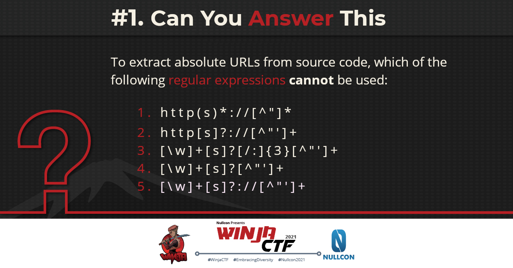

# Quiz
Prepare, before you play... #WinjaCTF2021

1. To extract absolute URLs from source code, which of the following regular expressions **cannot** be used?

    ```bash
    http(s)*://[^”]*
    http[s]?://[^”’]+
    [\w]+[s]?[/:]{3}[^”’]+
    [\w]+[s]?[^”’]+
    [\w]+[s]?://[^”’]+
    ```

    

    **Answer:** #4
    **Winner:** [Shivam Saraswat](https://twitter.com/thecybersapien)
    **Write-up:** 
    * https://cybersapien.medium.com/winja-ctf-extract-absolute-url-bd71cb14e4d3
    * https://riddhi-shree.medium.com/regular-expression-winjactf2021-fb3f48395910

2. 